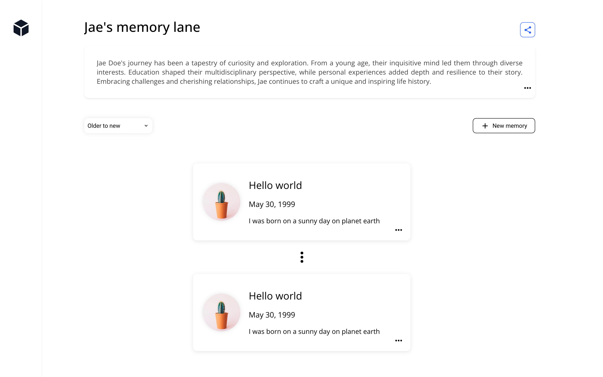

# Planned coding challenge: Memory lane

**Please avoid initiating pull requests on this repository or forking this repository. To submit your solution, either set up a repository on your own account.**

### Problem definition

After a series of discovery calls we found out a problem that one of users is facing. They are having a hard time sharing their memories with friends and family. They are using a combination of social media, messaging apps, and email to share their memories. They are looking for a solution that allows them to store and share their memories in a single place.

As a first iteration for this solution, we want to build a web application that allows a single user to create a memory lane and share it with friends and family. A memory lane is a collection of events that happened in a chronological order. Each event consists of a title, a description, a timestamp, and at least one image.

For this exercise, you are not required to make this work for multiple users with an auth system. You are not required to make a user system. Assume this is meant for a single user only. We have done this to simplify the exercise.

## Deliverables

- Clone this repository and create a new branch with your name. Open a pull request on your own instance of the repository.
- An updated README providing a high level explanation of your implementation.
- The provided mockup is only for reference and inspiration. Feel free to improve it!
- A Typescript and React app that allows creation of memory lanes by a single user (remember no auth or user system required).
- Use a database that would be appropriate for a early stage to mid stage startup.
- The app should have 2 views: a view for a single memory lane and a view for the list of memory lanes.
- Provide a preview link hosted on a thirdparty.

### FAQ

- **Can I use AI tools?** Absolutely. Use whatever tools help you complete the task the fastest.
- **Is user authentication required?** No, it is not required.
- **Can I use a component library?** Yes, you can use a component library -- especially if it helps you complete the assignment faster.
- **What will you be looking for?** Good user experience, reusable code, and a well thought out technical design.

### Closing notes

You will be asked to explain details of your implementation and tradeoffs so make sure you understand any code generated with AI tools.

### Inspiration mockup

